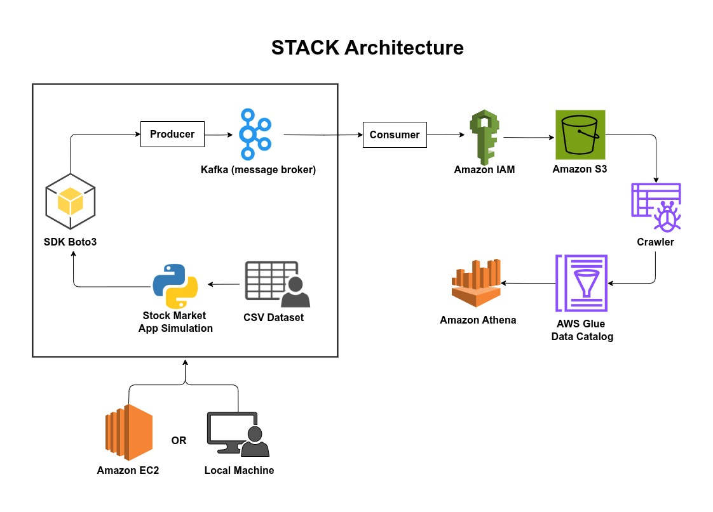

# STACK - Stock Transaction Analytics using Cloud & Kafka

# Overview
- **STACK**, which stands for *Stock Transaction Analytics using Cloud & Kafka*, is a highly **scalable**, cloud-native application designed to simulate stock market events in *real-time*. Built using a powerful combination of `Python`, `Apache Kafka`, and `AWS services`, STACK processes historical stock index data to generate realistic stock price events. The system supports deployment on both `Amazon EC2 instances` for high-throughput environments or `local machines` for lightweight testing, offering flexibility based on **scalability** and **cost-efficiency** needs.

- **STACK** begins by reading a **CSV dataset** that contains historical stock market data, including **stock prices**, **market indices**, and **timestamps**. At the core of the system is a `Python` script that orchestrates the simulation workflow, integrating with `AWS services` through the `Boto3 SDK`. This script is responsible for generating simulated **real-time** price fluctuations and managing the flow of data between components.

- A critical part of STACK is the use of `Apache Kafka` as a **real-time message broker**, which enables the efficient and reliable transmission of stock price events. The `Kafka producer` serializes these events into **JSON** and publishes them to a dedicated `Kafka topic`. A corresponding `Kafka consumer` then **deserializes** the messages and batches them for storage in `Amazon S3`, ensuring **low-latency** data flow and **high-throughput** processing.

- To facilitate data discovery and querying, STACK utilizes `AWS Glue`. The `Glue Crawler` continuously scans the `S3` bucket to infer the **schema** of newly ingested stock events. This metadata is stored in the `AWS Glue Data Catalog`, making the data accessible through `Amazon Athena`. With Athena, users can run `serverless SQL queries` directly on the raw JSON data, removing the need for traditional database infrastructure and enabling fast, cost-effective analytics.

- In essence, **STACK** delivers a fully integrated, cloud-scalable simulation framework for stock market data. By leveraging `Kafka` for streaming, `AWS` for compute and storage, and `Python` for orchestration, STACK provides a **highly available**, **fault-tolerant**, and **cost-efficient** environment. It is ideally suited for **data analysts**, **quantitative researchers**, and professionals in the *financial sector* who need a powerful platform for simulating and analyzing stock transactions in real-time.

# Key Features
**Real-time Stock Price Simulation**:
The app simulates stock market events using **historical stock data** to generate *real-time* stock price fluctuations, providing a **dynamic environment** for **market analysis** and **prediction**."

**Scalable Architecture**:
The system can be deployed on `Amazon EC2` for large-scale operations or a `local machine` for smaller-scale testing, offering flexibility in terms of **cost-efficiency** & **scalability**."

**Data Streaming with Apache Kafka**:
Using `Apache Kafka` as the **real-time message broker**, the app ensures **high-throughput** and low-latency data transfer of stock price events between the **producer** & **consumer**."

**Efficient Storage with Amazon S3**:
The stock price events are serialized into **JSON** format and stored in `Amazon S3`, ensuring **durability**, **scalability**, and **high availability** for large datasets."

**Integrated with Boto3 SDK**:
The **Python** script leverages the `Boto3 SDK` to integrate with `AWS services` such as `S3`, `IAM`, `Glue`, and `Kafka`, enabling efficient data flow and management in the cloud."

**Automatic Data Cataloging with AWS Glue**:
The `Glue Crawler` automatically scans the data stored in `S3`, infers the **schema** of incoming stock events, and updates the `AWS Glue Data Catalog`, making the data available for efficient querying."

**Serverless Querying with Amazon Athena**:
`Amazon Athena` is used for **serverless SQL querying** of the cataloged stock price data in `S3`, eliminating the need for a dedicated database and reducing infrastructure costs."

**Fault Tolerant & High Availability**:
With `Kafka` for message persistence and `S3` for storage durability, the app guarantees **fault tolerance** and **high availability** even during peak usage or system failures."

**Flexible Deployment Options**:
The app offers **flexible deployment options**, supporting both cloud-based operations via `Amazon EC2` and local development environments for testing, enhancing scalability and accessibility."

**Secure API Access with IAM**:
Both `Kafka producer` & `consumer` rely on `IAM roles` to authenticate and authorize API calls to `AWS services`, ensuring **secure access** to **resources** and **data protection**."

# Project Architecture


# Installation
1. Clone the repository:
   ```bash
   git clone https://github.com/ankitpakhale/STACK.git
   ```
2. Navigate to the project directory:
   ```bash
   cd STACK
   ```
3. Create a virtual environment:
	```bash
	python -m venv .venv
	```
4. Activate the virtual environment:
   - On Windows:
		```bash
		.venv\Scripts\activate
		```
   - On macOS/Linux:
		```bash
		. .venv/bin/activate
		```
5. Install the required dependencies:
	```bash
	pip install -r requirements.txt
	```
	
# Project Flow
- **Dataset (CSV file)**: A *stock market dataset* is used as the input.
  
- **STACK (Python)**: The **STACK** application in `Python` reads the dataset and acts as the `producer`.
  
- **SDK (Boto3)**: The **Python script** uses the `AWS Boto3 SDK` to interact with `AWS services`.

- **Kafka (Producer/Consumer)**: 
  - The **STACK** application acts as the `producer`, sending messages to `Kafka` hosted on an `Amazon EC2 instance`/`Local Machine`.
  - `Kafka` then sends the data to `consumers` for *processing*.

- **Amazon S3**: The `Kafka consumer` writes the data to an `Amazon S3 bucket`.

- **AWS Glue Crawler**: A *crawler* in `AWS Glue scans` the data in `S3`, extracting *metadata* and building a data catalog.

- **AWS Glue Data Catalog**: This metadata is stored in the `AWS Glue` Data Catalog, providing a structured way to *access the data*.

- **Amazon Athena**: `Amazon Athena` is used to run `SQL` queries against the data stored in the `S3 bucket`, leveraging the **Glue Data Catalog** for *schema* information.


# To run project on EC2
- Create new `t2.micro` machine
- Download `.pem file`
- Run this command: `chmod 400 kafka-stock-market-project.pem`


## Download Kafka:
- Open new `terminal`
- Connect to `EC2 using .pem file` 
-
	```bash
	wget https://downloads.apache.org/kafka/3.3.1/kafka_2.13-3.6.2.tgz
	```
- 
	```bash
	tar -xvf kafka_2.13-3.6.2.tgz
	```

## Start the Zookeeper:
- Open new `terminal`
- Connect to `EC2 using .pem file` 
- 
	```bash
	cd kafka_2.13-3.6.2
	```
- 
	```bash 
	bin/zookeeper-server-start.sh config/zookeeper.properties
	```

## Start the kafka Server:
- Open new `terminal`
- Connect to `EC2 using .pem file`
- 
	```bash
	cd kafka_2.13-3.6.2
	```
- 
	```bash
	bin/kafka-server-start.sh config/server.properties
	```

## Create the topic:
- Open new `terminal`
- Connect to `EC2 using .pem file` 
- 
	```bash
	cd kafka_2.13-3.6.2
	```
- 
	```bash
	bin/kafka-topics.sh --create --topic demo_testing2 --bootstrap-server {Put the Public IP of your EC2 Instance:9092} --replication-factor 1 --partitions 1
	```
- **Note:** Do not forget to change the topic name, currently it is  **demo_testing2**

## Start Producer & Consumer:
- Rename `.env_example` to `.env` and update the **bucket name** 
- Open new `terminal`
- `jupyter notebook`
- Change `localhost` to *public IP* of `EC2 Instance` in Create `Kafka Producer` section in `KafkaProducer.ipynb` file and **run** it. 
- Change `localhost` to *public IP* of `EC2 Instance` in Create `Kafka Consumer` section in `KafkaConsumer.ipynb` file and **run** it. 

# To run project on local machine

## Start the Zookeeper:
- Open new `terminal`
- 
	```bash
	cd kafka_2.13-3.6.2
	```
- 
	```bash
	bin/zookeeper-server-start.sh config/zookeeper.properties
	```

## Start the Kafka Server:
- Open new `terminal`
- 
	```bash
	cd kafka_2.13-3.6.2
	```
- 
	```bash
	bin/kafka-server-start.sh config/server.properties
	```

## Start Producer & Consumer:
- Rename `.env_example` to `.env` and update the **bucket name** 
- Open new `terminal`
- `jupyter notebook`
- run `KafkaProducer.ipynb`
- run `KafkaConsumer.ipynb`


# Create Crawler
- Create `Crawler` and *assign permissions* to access `S3 bucket`.
- Create `database` to *store data*.
- **Run** the `Crawler`.

# Athena
- Go to `Athena Console`.
- Select `Database` name.
- **Run** the `Athena Query`.

# Contributing
1. Fork the repository.
2. Create a new branch (`git checkout -b feature-branch`).
3. Commit your changes (`git commit -am 'Add new feature'`).
4. Push to the branch (`git push origin feature-branch`).
5. Create a new Pull Request.

# 🔐 License
This project is licensed under a **modified MIT License with restrictions**.
**Permission must be obtained from ANKIT PAKHALE ([akp3067@gmail.com](mailto:akp3067@gmail.com)) before using, copying, modifying, or distributing this software.**
See the [LICENSE](LICENSE) file for full details.
